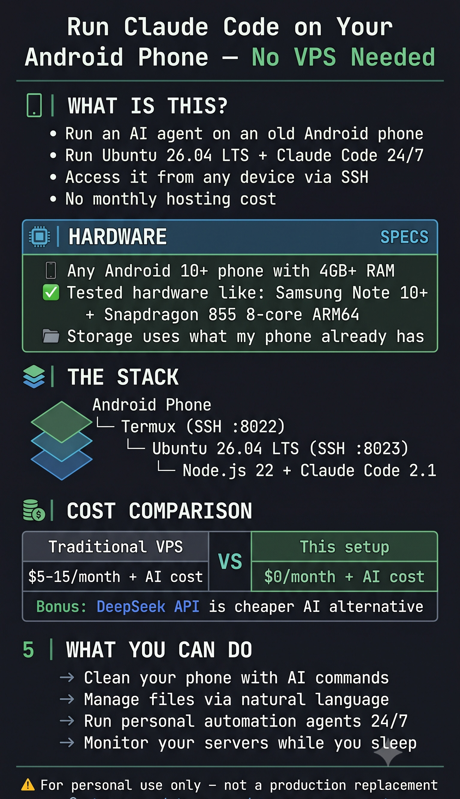

# 📱 Claude Code on Android — ARM64 AI Agent Server (No VPS Needed)

<p align="center">
  
</p>

> **"I turned my old Samsung into a Claude Code server that beats a $10 VPS — here's how"**

Run Claude Code on your Android phone as a 24/7 autonomous AI agent. No VPS, no hosting cost — just your phone running Ubuntu on ARM64.

> 💡 **Cost clarification:**  
> - **The server setup: free** — no VPS, no hosting fees, just your phone  
> - **Claude (Anthropic API): paid** — requires a [Claude subscription](https://claude.ai) or [API key](https://console.anthropic.com)  
> - **Bonus: DeepSeek API works too** — much cheaper, has a free tier (see [DeepSeek section](#-bonus-use-deepseek-api-instead-cheaper--free-tier))  
> - This project eliminates the *infrastructure* cost, not the AI cost

> **Tested on:** Samsung Galaxy Note 10+ · Snapdragon 855 · 8-core ARM64 · 12GB RAM · Android 12  
> **Should work on:** Any Android 10+ with at least 4GB RAM and Termux (F-Droid)


> 🙋 **This is my first open source contribution.** I'm not a professional developer —  
> just someone who figured out how to run Claude Code on an Android phone and thought  
> others might find it useful. Feedback, issues and PRs are very welcome!

---

## 🏗️ Server Architecture

```
┌─────────────────────────────────────────────────────┐
│           Samsung Galaxy Note 10+                    │
│                                                      │
│  CPU: Snapdragon 855 — 8-core ARM64 (aarch64)       │
│  ├── 1× Kryo 485 Prime @ 2.84 GHz                   │
│  ├── 3× Kryo 485 Gold  @ 2.42 GHz                   │
│  └── 4× Kryo 485 Silver @ 1.80 GHz                  │
│                                                      │
│  RAM:     12 GB  (~5-6 GB available for Ubuntu)      │
│  Storage: 228 GB (UFS 3.0 — ~450 MB/s write)        │
│  OS:      Android 12                                 │
│                                                      │
│  ┌──────────────────────────────────────────────┐   │
│  │  Termux (Android app)          :8022 SSH     │   │
│  │  └── proot-distro                            │   │
│  │      └── Ubuntu 26.04 LTS ARM64  :8023 SSH  │   │
│  │          ├── Node.js 22.16.0                 │   │
│  │          └── Claude Code 2.1.185  ← YOU ARE  │   │
│  │                                      HERE    │   │
│  └──────────────────────────────────────────────┘   │
└─────────────────────────────────────────────────────┘
         ↕ SSH over local WiFi
┌─────────────────────────────────────────────────────┐
│  Your PC / Any device on the same network           │
└─────────────────────────────────────────────────────┘
```

Connect from any device:
```bash
ssh -t ubuntu@YOUR_PHONE_IP -p 8023
claude  # ← Claude Code running on your phone!
```

---

## ⚠️ Critical: Get Termux from F-Droid — NOT Play Store

> The Play Store version of Termux is **outdated and broken**. Many packages will fail to install.

**Download Termux from F-Droid:**  
👉 https://f-droid.org/en/packages/com.termux/

The F-Droid version is actively maintained and always up to date.

---

## 📋 Requirements

- Android 10 or higher
- At least 4 GB RAM (8 GB+ recommended)
- At least 4 GB free storage
- Termux installed **from F-Droid** (NOT Play Store)
- A Claude subscription or Anthropic API key (**paid** — see [pricing](https://www.anthropic.com/pricing))

---

## 🚀 Installation

### Step 1 — Install Termux from F-Droid

1. Go to https://f-droid.org/en/packages/com.termux/
2. Download and install the APK
3. Open Termux

### Step 2 — Set up SSH in Termux

```bash
# Install OpenSSH
pkg update -y && pkg install openssh -y

# Set a password
passwd

# Start SSH server (port 8022)
sshd

# Find your phone's IP
ifconfig | grep 'inet ' | grep -v '127.0.0.1'
```

Now you can SSH into your phone:
```bash
ssh -p 8022 YOUR_USER@YOUR_PHONE_IP
```

> Your username looks like `u0_a636` — run `whoami` in Termux to find yours.

### Step 3 — Prevent Termux from being killed

This is critical. Android aggressively kills background processes. You need to do **both** of these:

#### 3a. Via ADB from your PC (one-time setup)

Install ADB on your PC: https://developer.android.com/tools/releases/platform-tools

Enable **Wireless Debugging** on your phone:  
`Settings → Developer Options → Wireless Debugging`

Connect via ADB and run:

```bash
# Exempt Termux from Doze mode
adb shell dumpsys deviceidle whitelist +com.termux
adb shell cmd deviceidle whitelist +com.termux

# Allow background execution
adb shell cmd appops set com.termux RUN_IN_BACKGROUND allow
adb shell cmd appops set com.termux WAKE_LOCK allow

# Disable app standby
adb shell settings put global app_standby_enabled 0

# Remove process limits (important for Samsung/One UI)
adb shell cmd device_config put activity_manager max_phantom_processes 2147483647
```

#### 3b. Configure Termux to auto-start services

Edit `~/.bashrc` in Termux:

```bash
cat >> ~/.bashrc << 'EOF'
# Keep Termux awake
termux-wake-lock 2>/dev/null &

# Start SSH server
sshd 2>/dev/null

echo "SSH ready on port 8022"
EOF
```

### Step 4 — Install Ubuntu via proot-distro

```bash
# Install proot-distro (in Termux)
pkg install proot-distro -y

# Install Ubuntu
proot-distro install ubuntu

# Verify
proot-distro login ubuntu -- bash -c "cat /etc/os-release | grep PRETTY"
```

### Step 5 — Install Node.js (ARM64 binary method)

> ⚠️ **Do NOT use `apt install nodejs`** — it fails in proot due to permission issues.  
> Use the official ARM64 binary instead:

```bash
proot-distro login ubuntu -- bash << 'EOF'
# Download Node.js 22 LTS ARM64 binary directly
curl -fsSL https://nodejs.org/dist/v22.16.0/node-v22.16.0-linux-arm64.tar.gz \
  -o /tmp/node.tar.gz

# Extract to /usr/local
tar -xzf /tmp/node.tar.gz --strip-components=1 -C /usr/local
rm /tmp/node.tar.gz

# Verify
node --version && npm --version
echo "Node.js installed successfully!"
EOF
```

> **Note:** Always use `.tar.gz` not `.tar.xz` — `xz` is not installed by default in proot Ubuntu.

### Step 6 — Install Claude Code

```bash
proot-distro login ubuntu -- bash << 'EOF'
npm install -g @anthropic-ai/claude-code
claude --version
echo "Claude Code installed!"
EOF
```

### Step 7 — Configure Ubuntu SSH on port 8023

```bash
proot-distro login ubuntu -- bash << 'EOF'
# Install SSH server
apt install -y openssh-server

# Configure port 8023
echo "Port 8023" >> /etc/ssh/sshd_config
sed -i 's/#PasswordAuthentication yes/PasswordAuthentication yes/' /etc/ssh/sshd_config
sed -i 's/#PermitRootLogin.*/PermitRootLogin yes/' /etc/ssh/sshd_config

# Create user
useradd -m -s /bin/bash myuser
echo "myuser:yourpassword" | chpasswd
usermod -aG sudo myuser
echo "myuser ALL=(ALL) NOPASSWD:ALL" >> /etc/sudoers

# Generate SSH host keys
ssh-keygen -A

# Start SSH
mkdir -p /run/sshd
/usr/sbin/sshd
echo "Ubuntu SSH ready on port 8023"
EOF
```

### Step 8 — Auto-start Ubuntu with Termux

Update `~/.bashrc` in Termux to auto-start Ubuntu:

```bash
cat > ~/.bashrc << 'EOF'
# Keep Termux awake
termux-wake-lock 2>/dev/null &

# Start Termux SSH (port 8022)
sshd 2>/dev/null

# Start Ubuntu SSH (port 8023)
proot-distro login ubuntu \
  --bind /data/data/com.termux/files/home:/mnt/termux \
  -- bash -c "mkdir -p /run/sshd && /usr/sbin/sshd" 2>/dev/null &

echo "Termux SSH  :8022 ready"
echo "Ubuntu SSH  :8023 ready"
EOF
```

### Step 9 — Authenticate Claude Code

```bash
# Connect to Ubuntu
ssh -t -p 8023 myuser@YOUR_PHONE_IP

# Inside Ubuntu, run Claude Code
claude
# Follow the login prompt (opens browser for OAuth)
# Or set your API key:
export ANTHROPIC_API_KEY="sk-ant-..."
```

> **Important:** Always use `ssh -t` (force TTY) when connecting to use Claude Code interactively.

---

## 📁 Access Android Storage from Ubuntu

Ubuntu can read and write to your phone's storage:

| Path in Ubuntu | Contents |
|----------------|----------|
| `/sdcard` | Full internal storage |
| `/storage/emulated/0` | Same (alternative path) |
| `/mnt/termux` | Termux home directory |

---

## 💡 Usage

```bash
# Connect to Ubuntu on your phone
ssh -t -p 8023 ubuntu@YOUR_PHONE_IP

# Interactive mode
claude

# Non-interactive (great for automation)
claude -p "Check my server logs and summarize any errors"
claude -p "List all files in /sdcard/Download over 100MB"
```

---

## 🔧 Troubleshooting

**Termux SSH not working after phone restart**
→ Open Termux once manually — `.bashrc` auto-starts everything

**Claude Code won't accept keyboard input**
→ Always connect with `ssh -t` flag (forces TTY allocation)

**`apt install` fails with permission error**
→ This is a proot limitation. Use the binary installation method shown in Step 5

**Claude Code takes 5-10 seconds to respond initially**
→ Normal — it's loading and connecting to the API

**Ubuntu SSH stops responding**
→ Ubuntu runs inside Termux — if Termux was closed, open it once to restart everything

---

## 📊 Performance vs VPS

| Metric | Snapdragon 855 (Note 10+) | Typical 4-core VPS |
|--------|--------------------------|-------------------|
| CPU cores | 8 (ARM64) | 4 (x86) |
| Single-core speed | ~2.84 GHz | ~2.5–3.5 GHz |
| RAM | 12 GB total | 8 GB |
| Storage speed | ~450 MB/s (UFS 3.0) | ~200–500 MB/s SSD |
| Server/hosting cost | **$0** | $5–15 USD |
| AI cost (Claude) | Anthropic plan required | Anthropic plan required |

---

## 🤝 Contributing

Found a bug? Have improvements? Pull requests welcome!

Tested on other devices? Please share your results in Issues.

---

## 📄 License

MIT — use freely, share openly.

---

---

## ⚠️ Disclaimer — Personal Use, Not Production

This setup is **functional for personal use** but should never be treated as a production environment.

| ✅ Great for | ❌ Not suitable for |
|-------------|---------------------|
| Personal AI agent on your home network | Public-facing web services |
| Automating personal tasks | High-availability requirements |
| Learning Linux/Claude Code | Sensitive data storage |
| Repurposing an old phone | Multi-user environments |
| Hobby projects and experiments | Business-critical workloads |

**Why?**
- The phone can restart, overheat, or run out of battery
- proot is not a real virtual machine — it has security limitations
- No SLA, no redundancy, no guaranteed uptime
- SSH is exposed on your local network (see Security section)

Think of it as a **powerful personal tool**, not a server rack replacement.

---

## 💡 What You Can Do With This

Once Claude Code is running on your phone, the possibilities are surprisingly wide:

### 🧹 Phone Maintenance (via SSH)
```bash
# Find and delete duplicate files
claude -p "Find all duplicate files in /sdcard/Download and list them by size"

# Clean old downloads
claude -p "List files in /root/downloads older than 6 months, grouped by type"

# Free up space intelligently
claude -p "Analyze /sdcard and tell me what's taking the most space and what's safe to delete"

# Organize photos
claude -p "List all photos in /root/photos/Camera taken before 2024 and count them"
```

### 📁 Smart File Management
```bash
# Find large files
claude -p "Find all files over 100MB in /sdcard and show them sorted by size"

# Rename files in bulk
claude -p "List all WhatsApp images in /sdcard/Android/media/com.whatsapp/WhatsApp/Media/WhatsApp Images/"

# Search content
claude -p "Find all PDF files in /sdcard/Documents and list their names"
```

### 🤖 Personal Automation Agent
```bash
# Monitor your VPS (if you have one)
claude -p "SSH into myserver.com and check if nginx is running and disk usage"

# Daily briefing
claude -p "Check the weather API and give me a morning summary"

# File watcher
claude -p "Check if any new files were added to /root/downloads in the last hour"
```

### 🛠️ Development & Learning
```bash
# Run Python scripts
claude -p "Write a Python script that monitors CPU temperature and alerts me if it exceeds 80°C"

# Git operations
# Install git first, then:
claude -p "Clone my GitHub repo and run the tests"

# API testing
claude -p "Test this API endpoint and tell me if it returns the expected response"
```

### 📊 Personal Data Analysis
```bash
# Analyze your downloads
claude -p "Look at /root/downloads and tell me what types of files I download most"

# Storage report
claude -p "Give me a full storage report of the phone organized by category"
```

### 🔔 Background Tasks (non-interactive)
```bash
# Run without keeping SSH open
nohup claude -p "Monitor /root/downloads for new files every 5 minutes for 1 hour" &

# Schedule with cron (install cron first)
echo "0 8 * * * claude -p 'Give me a morning system status report'" | crontab -
```

---

## 🔒 Security — Making It Safer

The default setup works on your **local network only**, but here are improvements you should apply:

### Basic Security (Do These)

**1. Change default SSH port (reduce bot scanning)**
```bash
# In Ubuntu /etc/ssh/sshd_config — change from 8023 to something less obvious
Port 34521   # pick any number 1024-65535
```

**2. Use SSH keys instead of passwords**
```bash
# On your PC, generate a key pair:
ssh-keygen -t ed25519 -C "my-android-server"

# Copy your public key to Ubuntu:
ssh-copy-id -p 8023 ubuntu@YOUR_PHONE_IP
# or manually paste ~/.ssh/id_ed25519.pub into ~/.ssh/authorized_keys on Ubuntu

# Disable password login:
echo "PasswordAuthentication no" >> /etc/ssh/sshd_config
```

**3. Disable root SSH login**
```bash
sed -i 's/PermitRootLogin yes/PermitRootLogin no/' /etc/ssh/sshd_config
```

**4. Firewall with fail2ban concept (manual)**
```bash
# Install fail2ban from Termux SSH method:
proot-distro login ubuntu -- bash << 'EOF'
apt install -y fail2ban
EOF
```

### Network Security

**5. Never expose ports to the internet**
- Keep SSH on local network only
- If you need remote access, use a **VPN** (WireGuard, Tailscale) instead of port forwarding

**6. Tailscale — Free secure remote access (recommended)**
```bash
# In Ubuntu, install Tailscale for secure remote access from anywhere:
curl -fsSL https://tailscale.com/install.sh | sh
# Then: tailscale up
# Access your phone from anywhere without exposing ports
```

**7. Keep Termux and Ubuntu updated**
```bash
# Termux (run weekly)
pkg update && pkg upgrade -y

# Ubuntu (from Termux SSH)
proot-distro login ubuntu -- bash -c "apt update && apt upgrade -y"
```

### What Stays Secure by Default
- ✅ SSH is local network only (no internet exposure)
- ✅ proot isolates Ubuntu from Android system
- ✅ Claude Code communicates with Anthropic API over HTTPS
- ✅ No ports are forwarded to the internet by default

### Known Limitations
- ⚠️ proot is not a real security sandbox — physical access to the phone = access to everything
- ⚠️ Passwords in Termux `.bashrc` auto-start scripts are visible as plaintext — use SSH keys
- ⚠️ The phone screen lock does not protect SSH access

---

---

## 🎁 Bonus: Use DeepSeek API Instead (Cheaper + Free Tier)

Don't want to pay for Anthropic? You can use **DeepSeek** as the AI backend instead — significantly cheaper with a free tier for testing.

### Why DeepSeek?

| | Anthropic Claude | DeepSeek |
|--|-----------------|----------|
| **Free tier** | No | ✅ Yes (~$5 credits on signup) |
| **Input price** | ~$3/M tokens | ~$0.27/M tokens |
| **Output price** | ~$15/M tokens | ~$1.10/M tokens |
| **Open source** | No | ✅ Yes |
| **Models** | Claude Sonnet/Opus | DeepSeek V3 / R1 |

> DeepSeek V3 and R1 are competitive with GPT-4 class models at a fraction of the cost.

### How it works

We run **LiteLLM** — a lightweight proxy that translates DeepSeek's API into the Anthropic format that Claude Code expects.

```
Claude Code → LiteLLM proxy (localhost:4000) → DeepSeek API
```

### Setup

**Step 1 — Get a free DeepSeek API key**  
👉 https://platform.deepseek.com — sign up and get free credits

**Step 2 — Install LiteLLM in Ubuntu**
```bash
pip3 install litellm[proxy]
```

**Step 3 — Create config**
```bash
cat > ~/litellm-config.yaml << 'EOF'
model_list:
  - model_name: claude-3-5-sonnet-20241022
    litellm_params:
      model: deepseek/deepseek-chat
      api_key: YOUR_DEEPSEEK_API_KEY

  - model_name: claude-3-opus-20240229
    litellm_params:
      model: deepseek/deepseek-reasoner
      api_key: YOUR_DEEPSEEK_API_KEY
EOF
```
> Model names are kept as Claude names so Claude Code works without changes.

**Step 4 — Start proxy and point Claude Code to it**
```bash
# Start proxy in background
litellm --config ~/litellm-config.yaml --port 4000 &

# Point Claude Code to proxy
export ANTHROPIC_BASE_URL="http://localhost:4000"
export ANTHROPIC_API_KEY="not-needed"

# Test
claude -p "hello, are you working?"
```

**Step 5 — Make it permanent**
```bash
cat >> ~/.bashrc << 'EOF'
# LiteLLM proxy for DeepSeek
litellm --config ~/litellm-config.yaml --port 4000 2>/dev/null &
export ANTHROPIC_BASE_URL="http://localhost:4000"
export ANTHROPIC_API_KEY="not-needed"
EOF
```

### ⚠️ Limitations

- Claude Code is optimized for Claude — some advanced agentic features may differ
- DeepSeek servers are based in China — avoid for sensitive/private data
- Response style differs (DeepSeek R1 shows reasoning steps)
- Free credits are limited — monitor your usage at platform.deepseek.com

### 💡 Pro tip: Switch between providers

```bash
# Use Anthropic Claude
unset ANTHROPIC_BASE_URL
export ANTHROPIC_API_KEY="sk-ant-..."

# Use DeepSeek (cheaper)
export ANTHROPIC_BASE_URL="http://localhost:4000"
export ANTHROPIC_API_KEY="not-needed"
```

---

## 🤝 Contributing

This is my first open source project and I'd love help from the community:


- 📱 **Tested on a different phone?** Open an issue and share your results
- 🐛 **Found a bug?** Pull requests are very welcome
- 💡 **Have a better way?** I'm learning — please share
- ⭐ **If it worked for you** — a star means a lot for a first-time contributor

---

## ⭐ If this helped you, please star the repo!

*My first open source contribution — built with curiosity, Claude Code,*  
*and a Samsung Note 10+ that deserved a second life as an AI server.* 🚀
